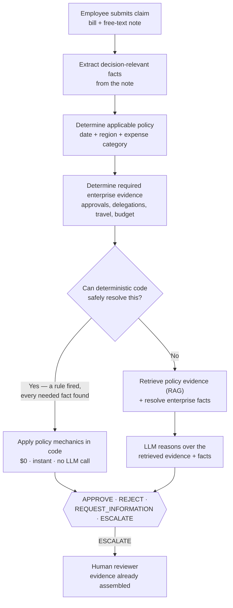

# ExpenseGuard — Resolves Expense Claims with Evidence

A bounded AI system for expense-claim compliance that combines deterministic automation, evidence-grounded
LLM adjudication, and explicit human escalation.

[](https://www.python.org/)
[](https://react.dev/)
[](https://vitejs.dev/)
[](https://numpy.org/)
[](https://pandas.pydata.org/)
[](https://matplotlib.org/)
[](https://openrouter.ai/)
[](https://ollama.ai/)
[](https://mermaid.js.org/)
[](tests/)
[](docs/owasp_llm_top10_2026.md)
[](docs/cost_and_business_impact.md)

*PE6201 (Emerging AI Technologies) end-of-course project. Built solo.*

## The story, in four moves

This is the data: 150 claims, a bill and a free-text note each, nothing pre-extracted, checked against a
22-document policy corpus and 11 enterprise systems. This is what had to be done: decide APPROVE / REJECT /
REQUEST_INFORMATION / ESCALATE, and never confidently approve a claim that shouldn't be. Here's what we
found, and what we did about it — twice:

| | 🔍 Found | 🛠️ Fixed | ⟶ Proof |
|---|---|---|---|
| **Round 1** | The frozen baseline scored 30/50 (60%), 0/37 false approvals — but its LLM step had **never once correctly approved a real approvable claim**, across dev, validation, or final test. | Root-caused it: the model was *shown* the right facts but not forced to use them. Rebuilt that step so tools compute the answer in code, enforced by a gate the model can't override. | Tested fresh, twice, on data neither version had seen: **+24pp and +30pp** over the baseline on each holdout — accuracy of **68%** and **66.7%**. |
| **Round 2** | Not satisfied with a test built to confirm the fix — built a second holdout **pre-registered before a single case existed**, designed to break it, not flatter it. | Nothing to fix yet — ran it once, as pre-registered, and reported the result unchanged. | It found what Round 1 missed: **one real false approval** the easier test never surfaced. Disclosed, not hidden. |

**The opposite of a clean win:** the fix is more accurate everywhere it's been tested — and still isn't
the one that ships. The original baseline is the official, frozen architecture, because it's the only one
with **zero false approvals across all 82 cases ever tested against it.** The improved design stays the
leading development candidate: better numbers, one formal validation pass short of the trust the frozen
baseline has already earned.

Full detail, every number sourced: [Results](#results).

## Security testing (OWASP LLM Top 10, 2026 edition)

**All 10 categories assessed** against the current OWASP Top 10 for LLM Applications (2026, published
2026-08-04) — 9 of 10 carry forward unchanged real evidence from the original assessment; one (Hidden
Context Exposure, formerly System Prompt Leakage) is disclosed as only partially covering its newly
broadened scope, not silently claimed as fully tested.

- **Zero fabricated policy citations** — checked all 897 citations ever saved across every experiment
  against the real policy corpus.
- **Budget and step caps verified live** — `MAX_BUDGET_USD` confirmed to actually raise `BudgetExceeded`
  when hit, not just configured and assumed to work.
- **One risk disclosed, not hidden:** prompt injection (LLM01) is not solved — a retrieval-text injection
  attack defeated the current defense once, live, in testing.

Full assessment, all 10 categories: [`docs/owasp_llm_top10_2026.md`](docs/owasp_llm_top10_2026.md).

---

## Table of contents
[The story](#the-story-in-four-moves) · [Security](#security-testing-owasp-llm-top-10-2026-edition) ·
[Problem](#problem) · [What it is](#what-it-is) · [What it does](#what-it-does) · [Who it's for](#who-its-for) ·
[Closest alternatives](#closest-alternatives-and-the-gap) · [Build vs. buy](#build-vs-buy) ·
[The data](#the-data) · [How it works](#how-it-works) · [Architecture rationale](#architecture-rationale) ·
[Results](#results) · [Business impact](#business-impact) · [Experiments](#experiments) ·
[Quick start](#quick-start) · [Reproducibility](#reproducibility) · [Screenshots](#screenshots) ·
[Repo map](#repo-map) · [Limitations](#limitations) · [Deliverables](#deliverables) · [Learn more](#learn-more) ·
[OWASP Top 10 (full results)](#owasp-top-10-for-llm-applications-2026-full-results)

---

## Problem

Corporate finance reviewers manually check every expense claim against policy, by hand:

- A claim is just a **bill + a free-text note** — nothing pre-extracted, nothing structured.
- Decision-critical facts (nights stayed, attendee counts, exception references, even the expense
  category) are buried in prose, not form fields.
- Checking one claim means cross-referencing a **22-document policy corpus** and **11 enterprise systems**
  (approvals, delegations, travel requests, budgets, prior claims) by hand.
- A wrong **approval** costs real money; a wrong **rejection** or unnecessary escalation costs reviewer
  time and employee trust. Both are real failure modes, not just one.

## What it is

An AI system that reads a claim, checks it against policy and enterprise records, and returns one of four
outcomes — **APPROVE / REJECT / REQUEST_INFORMATION / ESCALATE** — with the evidence it relied on attached
to every decision.

## What it does

- **This project is agentic**: three generations of a hand-written, tool-using ReAct agent were built and
  evaluated from scratch (`src/agent.py`, no agent framework; own tools in `src/tools.py` — Exp 19-20,
  34-59), not assumed necessary or skipped. It's not the final shipped architecture, because it didn't
  clear the project's own safety bar as reliably as the simpler design — an evidence-based finding, not an
  untested assumption either way.
- Resolves claims it can **prove** correct using deterministic code — $0, no model call, no ambiguity.
- Falls back to retrieval-grounded LLM reasoning only for claims code alone can't resolve.
- Treats `ESCALATE` and `REQUEST_INFORMATION` as **safe, first-class outcomes** — never forces a guess.
- Attaches the policy clauses and resolved facts behind every decision — no answer without evidence.
- Enforces three hard boundaries in code, not just prompting: **read-only** (no write tools), **no
  guessing under uncertainty**, **no answer without evidence**.

## Who it's for

**Maya — finance operations analyst**, reviewing expense claims against company policy. It's 4pm on the
last day of the month, and her queue has 60 claims in it. She already knows the policy corpus cold and
roughly which categories tend to cause trouble (hotel ceilings, mileage math); what she doesn't have is
time to re-verify every routine claim against every record by hand, or visibility into which few of the 60
actually need her judgment versus a human-readable rubber stamp.

| Before ExpenseGuard | After ExpenseGuard |
|---|---|
| Manually reads every claim, travel record, approval, exception, prior claim | Only sees claims with missing evidence, conflicting evidence, or policy-mandated human review |
| Spends equal time on routine and hard cases | Attention concentrated on the hard cases |
| Decisions and reasoning vary reviewer to reviewer | Routine claims resolved consistently, with cited evidence |

Employees benefit too: faster resolution, specific requests for missing information instead of silence,
and evidence-backed reasons for a rejection — not just "denied."

## Closest alternatives, and the gap

Enterprise platforms (SAP Concur / Concur Detect, Brex, Ramp) already automate large parts of expense
compliance. This project doesn't claim AI-based expense checking is new. The narrower question it
investigates: **does dynamic, cross-system evidence gathering add measurable value when the correct next
check depends on what a previous lookup reveals** — and if so, how much architectural complexity does that
actually justify, versus a deterministic-first design? [`problem.md` §3](problem.md).

## Build vs. buy

**Rent:** the foundation model (`openai/gpt-4o-mini` / `llama3.2:3b`) and the embedding model
(`voyageai/voyage-4-lite`) — commodity capability this project's own experiments (Exp 8, 35, 46) confirmed
was not the actual bottleneck. **Own:** policy mechanics, retrieval tuning, the enterprise-tool layer,
orchestration and guardrails, and the evaluation harness — the parts that encode this specific problem and
this project's own research contribution. Full layer-by-layer breakdown:
[`docs/build_vs_buy.md`](docs/build_vs_buy.md).

## The data

| | |
|---|---|
| Claims | **150** — 70 development / 30 validation / 50 held-out final test |
| Policy corpus | **22 documents**, ~38 pages — global rules × 3 policy years, regional addenda, circulars |
| Enterprise tables | **11**, read-only — approvals, delegations, travel requests, budgets, prior claims |
| Ground truth | Isolated in `04_ground_truth_PRIVATE/`, joined only by the evaluator — never read at runtime |

A claim looks like this — nothing pre-extracted, the note is the only place most facts live:

```json
{
  "case_id": "X2-001",
  "bill": { "merchant": "PureYoga Club", "country": "Singapore", "total": 24.9, "merchant_category": "OTHER" },
  "employee_description": "so um this is for a charge for the renewal at PureYoga Club you know
                            it's in Singapore and um it really keeps me sane during the busy quarter...",
  "project_id": "PRJ-003"
}
```


*150 claims, 3 architecture groups, outcome distribution by split — real counts from the generated dataset.*

**Case families** — every claim falls into one of these:

| Family | What makes it hard |
|---|---|
| Clean / policy-violation | Apply the right clause, nothing else in play |
| Missing information | `REQUEST_INFORMATION` with the exact missing field |
| Duplicate / near-duplicate / split | Exact repeat vs. legitimate repeat vs. charges that jointly cross a threshold |
| Temporal / regional policy | Same expense type, governed differently by year or region |
| Evidence conflict | Note and bill disagree — request clarification or escalate, never accuse |
| Dynamic investigation | An earlier tool result determines what to check next |

Full package: [`ExpenseGuard_DATASET/`](ExpenseGuard_DATASET/). Generation, hardening, and leakage
prevention: [`docs/synthetic_data_provenance.md`](docs/synthetic_data_provenance.md),
[`docs/dataset_card.md`](docs/dataset_card.md).

## How it works

### Baseline — how a reviewer does this today, without ExpenseGuard

| | Value | Measured or assumed |
|---|---|---|
| Time per claim | **~20 minutes** | **Assumed** — [GBTA Foundation](https://gbta.org/new-study-reveals-pain-points-in-expense-reporting/) |
| Cost per claim (reviewer time only) | **~$11.67** (20 min × $35/hr reviewer) | **Assumed** — same reviewer rate used throughout this project's cost model |
| Reports with errors or missing info | **~19%** | **Assumed** — GBTA, same source |
| Cost of one wrong approval | **$150** | **Assumed** — this project's own labeled cost-model assumption (base scenario) |
| Cost of one wrong rejection (rework, delay, morale) | **$50** | **Assumed** — same cost model |

A reviewer reads the bill and note, then manually cross-references policy and up to 11 enterprise systems
by hand, for every single claim, with no evidence trail attached to the decision.

### ExpenseGuard's approach — the same decision, broken into inspectable steps



This is the **official, frozen architecture** (Exp 30/32). A second, later design — a bounded agent whose
tools *compute* the disposition in code, gated so the model can't override a correct tool answer — scores
higher on development/validation but has no authorized frozen final-test result. Full reasoning in
[Architecture rationale](#architecture-rationale) below.

### Baseline vs. ExpenseGuard

| | Baseline (manual, no AI) | ExpenseGuard |
|---|---|---|
| Time per claim | ~20 min, assumed end-to-end manual process (assumed) | Median 1.3s residual / ~0s deterministic — **model inference latency only, not directly comparable to the end-to-end baseline figure** (**measured**) |
| Cost per claim | ~$11.67 reviewer time (assumed) | ~$0.0005/claim AI cost (**measured**) + reviewer time only for the 22% escalated |
| Report-quality issue rate (not the same metric as FAR — GBTA's figure is reports with errors/missing info, not a reviewer decision-error rate) | ~19% (assumed) | 0/37 = 0% observed false approvals, final test (**measured**) — shown together for business context only, not as a like-for-like comparison |
| Cost of a wrong approval | $150/case (assumed) | Same $150 assumption applied to 0 observed instances — see [Business impact](#business-impact) |
| Cost of a wrong rejection | $50/case (assumed) | 100% of truly approvable claims (20/20) wrongly blocked on a fresh sample (**measured**, Exp 60) — a real, priced-in cost this project does not hide |

## Architecture rationale

**Built solo, end to end** — dataset design and generation, every architecture (rules → RAG → workflow →
agent), the evaluation harness, cost model, and security testing all owned by one person, not assembled
from a template.

**The complexity ladder — one rung at a time, only when the previous one proved insufficient:**

| Rung | Added because | Kept or dropped |
|---|---|---|
| Deterministic rules | Arithmetic, dates, explicit ceilings are checkable — no reason to ask a model | **Kept** — 22/22 (100%) on unseen final-test claims |
| RAG | Facts live in free text; rules alone can't read prose | **Kept**, tuned (chunking, top-K, hybrid retrieval, metadata filter) |
| Fixed workflow | Tested whether a fully pre-declared pipeline beats ad-hoc LLM reasoning | **Rejected** — more accurate (64%) than LLM-only, but unsafe alone (13.5% FAR) → motivated the deterministic/LLM-residual selective resolver instead |
| Bounded agent | Tested whether dynamic tool choice earns its cost over a fixed workflow | **Rejected at first gate** (Exp 20, 3x the FAR) — reopened later only once tools computed answers in code |

**Key tradeoffs made, explicitly:**
- **Accuracy was traded for safety, repeatedly** — the official, frozen architecture is *not* the most accurate one
  tested; it's the one with 0% observed false approvals. A 64%-accurate fixed workflow was rejected for a
  13.5% false-approval rate.
- **A frozen final-test result was treated as non-negotiable evidence**, not a formality — the
  higher-scoring guarded-agent candidate is still not promoted to that status because it has never earned one.
- **"0% FAR" was not trusted on a single sample** — a second, independent, pre-registered holdout (Exp 61)
  was run specifically to stress-test that claim, and it found a real gap the first holdout missed.

## Results

**Target for any later candidate to be considered a replacement:** FAR ≤ 0% (hard constraint, never traded
off) at accuracy ≥ 60% — the bar Exp 32 below actually cleared and every later candidate has been held to
since (`problem.md` §"Metric family, target, and baseline").

### Baseline — the official, frozen result

**Exp 32, one-shot, 50-claim held-out final test** — this number is the baseline everything below is
measured against, compared here to majority-class REJECT (26.0% accuracy / 0% FAR, computed from real
ground truth):

| Metric | Value | Takeaway |
|---|---|---|
| Accuracy | **30/50 = 60%** | More than double the majority-class baseline (26%) |
| Observed false approvals | **0/37 = 0%** | Zero bad approvals in this one-shot evaluation run |
| Deterministic path | **22/22 = 100%** | Every claim code could resolve, it resolved correctly |
| LLM-residual path | **8/28 = 28.6%** | The one weak component — motivated everything below |


*n=20 residual-path errors, final test. Takeaway: errors were policy-reasoning failures, not retrieval
failures — 0 of 20 were caused by missing evidence, which is exactly what the improvement work below targeted.*

### The improvement journey — what came after, and why it matters

The 28.6% LLM-residual accuracy above was the dominant measured weakness in the frozen architecture.
Rather than stop at the frozen result, 28 more experiments (Exp 34–61) built and stress-tested a second
design — a guarded agent whose tools compute the answer in code instead of leaving it to free-form LLM
judgment. The frozen baseline and the guarded candidate were then evaluated head-to-head on the same cases
*within* each of two separate, independent fresh holdouts (Exp 60 and Exp 61 are different case sets from
each other, not the same cases reused):

| Fresh holdout (never seen by either design) | Baseline (frozen resolver) | Candidate (fixed, guarded agent) | Change |
|---|---|---|---|
| Exp 60 — 50 cases | 22/50 = 44% | **34/50 = 68%** | **+24 percentage points** |
| Exp 61 — 30 cases, pre-registered | 11/30 = 36.7% | **20/30 = 66.7%** | **+30 percentage points** |

**+24 and +30 percentage points, on two independent samples the candidate was never tuned against** — real
evidence that routing decisions through code-computed, gated tools instead of raw LLM judgment is a
genuine improvement, not an artifact of one lucky test set. (Exp 61's holdout is also the methodologically
stronger of the two: its architecture and evaluation protocol were named and frozen in a committed manifest
*before* any holdout case was generated, closer to Exp 32's own pre-registration rigor than Exp 60's.) The
candidate also held up on the splits it was built against: 44/70 dev (62.9%), 21/30 validation (70.0%).

**Why this matters, not just that it's higher:** the baseline's weakness wasn't noise — it had never
once produced a correct APPROVE, on any split, ever (0/13 final test, 0/20 Exp 60, 0/15 Exp 61). The
candidate recovers real APPROVE recall (12/20, 9/15) without guessing — each one is backed by a tool
result, not a model's free-form judgment.

### Why it isn't the official architecture yet — the discovery that makes these numbers trustworthy

A higher number alone isn't the bar this project uses — **0% false approvals is**. The candidate matched
that bar on its first fresh test (Exp 60) and *almost* held it on a second, deliberately harder,
pre-registered one (Exp 61):

| | Official frozen architecture | Guarded-agent candidate |
|---|---|---|
| Tested on | 50-claim final test (official, one-shot) | 70 dev + 30 validation (authorized), + 2 fresh holdouts above |
| False approvals, ever | 0 (82 non-approvable cases across 3 independent evaluations) | 1 (45 non-approvable cases across both fresh holdouts, ~2.2%) |
| Status | **Official, frozen architecture** | **Leading development candidate** — not promoted |

That one false approval (Exp 61, a gift-form parsing gap, [diagnosed and disclosed](docs/exp61_v3_holdout.md))
is the actual reason the candidate isn't official yet — not a lack of accuracy. Finding it is also the
reason these numbers can be trusted at all: a result that's never been stress-tested isn't evidence, it's
a guess that happened not to fail yet. (A stronger model, gpt-4o, pushed accuracy to 78% on Exp 60 but
introduced 2 false approvals there too — further confirmation that accuracy and safety move independently,
not together.) Full detail: [`docs/exp60_fresh_holdout.md`](docs/exp60_fresh_holdout.md),
[`docs/exp61_v3_holdout.md`](docs/exp61_v3_holdout.md).

**In one sentence:** the guarded architecture appears to solve substantially more of the original business
problem than the frozen baseline, but it has not yet met this project's safety threshold consistently
enough across independent tests to be promoted.

### Safe-automation breakdown

Accuracy alone blends a false approval (a safety failure) with a false rejection (a real claim wrongly
blocked — a cost, not a danger). Broken apart, Exp 60 (n=50, of which 20 cases are truly approvable):

| | Safely automated, correct (of all 50) | False approvals (of 30 non-approvable) | False rejections (of all 50) | **False-rejection rate (of 20 truly approvable)** |
|---|---|---|---|---|
| Frozen resolver (baseline) | 21/50 = 42% | 0/30 | 20/50 = 40% | **20/20 = 100%** |
| Candidate, gpt-4o-mini | **33/50 = 66%** | 0/30 | 2/50 = 4% | **2/20 = 10%** |

*Takeaway: the baseline's 0% FAR headline hides that, among claims that were genuinely approvable, it
wrongly blocked every single one (20/20). That's a materially different and more alarming statement than
"40% of all cases," and it's the number that actually describes the baseline's blind spot. The candidate
cuts the same rate to 1 in 10 while holding false approvals at zero, on this particular test.*

## Business impact

Per `problem.md` §36: **measured** system quantities and **assumed/modeled** business inputs are never
blended into one number.

| Metric | Value | Measured or assumed |
|---|---|---|
| Turnaround (LLM-residual decisions) | **Median 1.3s, P95 2.6s** (50-claim final test) — model inference latency, not an end-to-end processing time | **Measured** |
| Turnaround (deterministic decisions) | **~0s, $0** | **Measured** |
| Cost per claim (frozen design) | **~$0.0005/claim** | **Measured** |
| Human Review Rate | **22.0%** — 78% resolved without a person | **Measured** |
| False-approval rate | **0/37 = 0% observed** (final test) | **Measured** (not a guarantee — see Limitations) |
| False-rejection rate among truly approvable claims | **20/20 = 100% observed** (Exp 60, frozen baseline) — candidate cuts this to 10% (2/20) | **Measured** |
| Manual review turnaround (industry baseline) | ~20 min/report, assumed end-to-end process | **Assumed** — [GBTA Foundation](https://gbta.org/new-study-reveals-pain-points-in-expense-reporting/) |
| Reports with errors/missing info (industry baseline) — a data-quality metric, not a decision-error rate | ~19% | **Assumed** — GBTA, same source |
| Modeled cost/1,000 claims at scale | $2,100–$54,700, scenario-dependent | **Modeled** — [full model](docs/cost_and_business_impact.md) |

**The argument this supports:** *if* a real deployment's end-to-end manual-review time resembles the
~20-minute industry baseline above, resolving 78% of claims without a human — at sub-2-second model
latency on the residual path — reduces avoidable review effort. The 19% baseline error-rate figure is
business context (how messy real expense reports tend to be), not a claim that ExpenseGuard's 0% FAR is
being compared against a measured human error rate — no such figure exists in the GBTA source or
elsewhere in this project. **No claim of measured production savings is made** — that requires a real
deployment, not this synthetic benchmark.

## Experiments

**55 experiments, numbered 0–61, 7 phases** — numbers 21–27 were deliberately skipped (the agent-value
gate closed before those were needed, see [Limitations](#limitations)); the count (`ALL_EXPERIMENTS.length`
in the demo UI's own experiment log) is mechanically verified, not hand-counted. Every number traces to a
file under `results/current/`, nothing hand-typed.

| Phase | Experiments | Outcome |
|---|---|---|
| 1. Baselines & retrieval | 0–17 | Retrieval was not the dominant bottleneck in the frozen resolver — a perfect policy oracle produced only a modest accuracy gain. (Later agent experiments found a *different* retrieval problem: the agent's own dynamically-generated search queries, mean recall 33.6% — a real, separate, secondary failure mode, not evidence against this finding.) |
| 2. Workflow vs. agent gate | 18–20 | Workflow more accurate (64%) but unsafe (13.5% FAR) → motivated the selective design |
| 3. Freeze & final test | 28–33 | **Official result: 30/50 (60%), 0% observed FAR** |
| 4. Agentic-RAG diagnosis | 34–39 | Stricter prompts, bigger models, parallel calls all failed; Exp 38 found the agent's own retrieval queries recalled only 33.6% of required clauses — reasoning and retrieval are two separate real problems |
| 5. Guarded-agent build | 40–52 | 44/70 dev, 21/30 validation, 0% FAR — promising, not yet held-out tested |
| 6. Root-cause, fix, fresh-holdout | 53–60 | Diagnosed 3 root causes live, fixed each: 0% FAR, 68% accuracy on a fresh, never-seen holdout (not formally pre-registered) |
| 7. Pre-registered second holdout | 61 | A second, independently pre-registered holdout (manifest frozen before case generation) found "0% FAR" did not survive — a real 6.7% FAR, disclosed, not fixed |

Full experiment index and diagnostic flowcharts: [`docs/README.md`](docs/README.md#full-experiment-index).

## Quick start

**Before you clone:** everything free (tests, dataset validation, the static UI export, `llama3.2:3b`
experiments) runs with no account and $0. Anything marked "paid" needs your own OpenRouter API key and
spends real money against it. Separately — the dataset was regenerated once after Exp 32's official run, so
Exp 32's result (`results/current/final_test/exp32_final_test/`) can no longer be byte-verified against the
files on disk today; it stands as the honest record of that one run, not something this checkout can
re-derive from scratch (full detail: [`docs/synthetic_data_provenance.md`](docs/synthetic_data_provenance.md)).

```bash
git clone <this-repo-url> && cd ExpenseGuard-Resolves-Expense-Claims-with-Evidence
pip install -r requirements.txt            # numpy, matplotlib, pandas, jupyter — runtime code itself is stdlib-only
cp .env.example .env                       # see table below before running anything paid
```

| `.env` variable | For | Notes |
|---|---|---|
| `OPENROUTER_API_KEY` | Paid-model calls | openrouter.ai — costs real money once set |
| `PAID_MODEL` | Paid experiments | Defaults to `openai/gpt-4o-mini` |
| `LOCAL_MODEL` | **Free** experiments | `llama3.2:3b` via [Ollama](https://ollama.ai) — everything here was reproducible at $0 |
| `MAX_BUDGET_USD` | Any paid call | This project's own tracked cap — `src/llm.py` raises `BudgetExceeded` once hit. Separate from, and smaller than, your OpenRouter account's own usage cap, which this project cannot see or control. |

**Run the live demo:**
```bash
python -m ui.backend.server                              # backend, http://localhost:8787
cd ui/frontend && npm install && npm run dev              # frontend, http://localhost:5173
```
Four verified walkthrough cases: [`docs/demo_script.md`](docs/demo_script.md).

## Reproducibility

```bash
python -m unittest discover -s tests      # leakage, tool, workflow checks — 44 tests, $0
python -m dataset_generator.validate      # dataset integrity audit — 50/50 checks, $0
```

- Every result traces to a file under `results/current/` — nothing in these docs is hand-typed.
- `tests/test_no_leakage.py` enforces that runtime code never reads `04_ground_truth_PRIVATE/`.
- ⚠️ **`python -m scripts.exp32_final_test` is the frozen final test — already run once. Do not rerun it**
  — see [`docs/second_touch_disclosure.md`](docs/second_touch_disclosure.md) for what happens when this
  rule is violated.
- Regenerate the dataset from scratch (deterministic, seed 6202, not required to run anything above):
  `python -m dataset_generator.build`.

## Screenshots

No screenshot images are committed (keeps the repo lightweight) — run the quick start above to see it
live. Four tabs:

| Tab | What it shows |
|---|---|
| **Overview & Story** | Scroll-revealed experiment timeline, live stats computed from the full 150-case export |
| **Case Explorer** | Every claim, both architectures' decisions side by side, full tool trace, ground truth |
| **Build & Architecture** | Pipeline diagrams, cost model, OWASP Top 10 results, build-vs-buy table |
| **Project Story** | Single-page presentation mode covering the whole project, end to end |

A design-rationale gallery of every retrieval/chunking/model experiment's own plot:
`results/current/plots/` (24 images, referenced individually throughout `docs/`).

## Repo map

| Path | Contents |
|---|---|
| `ExpenseGuard_DATASET/` | Claims, policy corpus, enterprise tables, isolated ground truth |
| `src/` | Runtime code — deterministic rules, typed tools, resolver, bounded agent, retrieval, evaluator |
| `dataset_generator/` | Dataset generator — case archetypes, policy text, semantic-hardening layer |
| `scripts/` · `notebooks/` | One script and one notebook per experiment |
| `tests/` | Unit tests, including the leakage guard |
| `experiments/` | Pre-registered freeze manifests (Exp 32, Exp 61) + the Exp 60/61 holdout datasets. Exp 60 has no manifest by design — that gap is what Exp 61 exists to close |
| `results/current/` | Predictions, metrics, plots, cached embeddings — single source of truth |
| `docs/` | One write-up per experiment (hypothesis → method → result → decision) |
| `ui/` | Local demo app — browse the dataset or run either design live |

## Limitations

- **Experiments 21-27 were deliberately skipped, not forgotten or lost.** Exp 20 failed the pre-defined
  agent-value/safety gate (a bounded agent only tied the fixed workflow, at 3x the false-approval rate),
  so the agent-optimization experiments planned as Exp 21-27 were never run — the numbering gap is
  intentional and documented, not a data-loss issue.
- **The guarded-agent candidate has no authorized, frozen final-test result.** Two independent fresh
  holdouts exist (Exp 60, Exp 61) — real evidence the fixes generalize, not a substitute for a formal,
  Exp-32-scale final test.
- **"0% FAR" is not an established property of the candidate** — combined observed FAR is ~2.2% (1/45),
  found by deliberately testing the claim a second time rather than trusting one result.
- **Synthetic benchmark, not production evidence** — every claim, policy document, and enterprise record
  is generated.
- **Same-model blind spot** — every claim note, in every split including both fresh holdouts, was drafted
  by the same model (`gpt-4o-mini`) that the system also uses to decide them; nothing here was checked
  against human- or differently-modeled text, so this benchmark cannot rule out that some measured accuracy
  reflects the model parsing its own writing style rather than reasoning that would transfer to real claims.
- **Prompt injection is not solved** — a retrieval-text injection attack defeats the current defense
  outright (Exp 28), disclosed, not fixed.
- **The held-out data was touched a second time after the Exp 32 freeze**, by a process not fully
  identified — did not change the official result, but "touched once" is no longer unqualified. Full
  disclosure: [`docs/second_touch_disclosure.md`](docs/second_touch_disclosure.md).
- **No real-world validation or deployment plan exists** — this is decision support for a research
  benchmark, not a production system.

## Deliverables

- **Dataset** — 150 synthetic claims, 22-document policy corpus, 11 enterprise tables, isolated ground
  truth, deterministic generator (`dataset_generator/`).
- **Four architectures, implemented and compared** — deterministic rules, RAG, fixed workflow, bounded
  agent — plus the selective hybrid that's the official, frozen architecture.
- **Evaluation harness** — leakage-safe evaluator, freeze-manifest discipline, cost model, OWASP Top 10
  for LLM Applications security assessment.
- **55 experiment write-ups** (`docs/`), numbered 0–61 with a deliberate gap at 21–27, each hypothesis → method → result → decision, traced to saved
  result files.
- **Local demo application** — React frontend + Python backend, browse all 150 cases or run either design
  live against a free or paid model.
- **Final report** — [`docs/FINAL_REPORT.md`](docs/FINAL_REPORT.md), 1,200 words.

## Learn more

- **Full diagnostic story, every experiment, extended flowcharts:** [`docs/README.md`](docs/README.md)
- **Business problem and scope:** [`problem.md`](problem.md)
- **Cost and operating-cost model:** [`docs/cost_and_business_impact.md`](docs/cost_and_business_impact.md)
- **Responsible AI / OWASP Top 10 for LLM Applications (2026):** [`docs/responsible_ai_risk_table.md`](docs/responsible_ai_risk_table.md), [`docs/owasp_llm_top10_2026.md`](docs/owasp_llm_top10_2026.md)
- **Bugs found after the freeze, documented not silently patched:** [`docs/post_freeze_findings.md`](docs/post_freeze_findings.md)
- **Disclosure: a second, undocumented run touched the held-out data after the freeze:** [`docs/second_touch_disclosure.md`](docs/second_touch_disclosure.md)
- **Root-causing why the candidate still missed APPROVE cases (Exp 53-59):** [`docs/exp53_approve_calibration.md`](docs/exp53_approve_calibration.md) → [`docs/exp59_final_fix.md`](docs/exp59_final_fix.md)
- **Fresh-holdout validation and the stronger-model safety tradeoff (Exp 60):** [`docs/exp60_fresh_holdout.md`](docs/exp60_fresh_holdout.md)
- **Pre-registered second holdout that found the candidate's first false approval (Exp 61):** [`docs/exp61_v3_holdout.md`](docs/exp61_v3_holdout.md)

## OWASP Top 10 for LLM Applications (2026): full results

The current, officially published edition is the **2026** edition (published 2026-08-04, verified live
against two independent sources). All 10 categories assessed, **$0 cost** (free local model for live
probes; the rest static checks or reasoned scoping, no new API calls). 9 of 10 categories carry forward
unchanged real test evidence; full detail: [`docs/owasp_llm_top10_2026.md`](docs/owasp_llm_top10_2026.md).

| Category | Status | Evidence |
|---|---|---|
| LLM01: Prompt Injection | **Not solved** — disclosed open risk | Retrieval-text injection defeated the defense in one live attack |
| LLM02: Sensitive Information Disclosure | Tested | Crafted request for another employee's data; not disclosed (safe fallback to ESCALATE) |
| LLM03: Excessive Agency | Mitigated | Disposition gate, domain guards, step cap, call deduplication |
| LLM04: Supply Chain | Tested | `npm audit`: 1 moderate finding, documented, not fixed. Python deps all current; runtime code imports no third-party package |
| LLM05: Data and Model Poisoning | Scoped — not applicable | No model is fine-tuned or trained; every model is an unmodified foundation model |
| LLM06: Unbounded Consumption | Tested | `MAX_BUDGET_USD` confirmed live to actually raise `BudgetExceeded`; step cap bounds worst-case cost |
| LLM07: Misinformation | Tested | All 897 policy-evidence citations ever saved, checked against the real corpus — **zero fabricated citations** |
| LLM08: Hidden Context Exposure | **Partially tested** | Renamed and broadened from "System Prompt Leakage." The system-prompt sub-case was tested — a "print your system prompt" attack did not echo system-prompt text (safe fallback). The broader RAG-schema/hidden-policy-logic scope was **not** separately probed — disclosed as open, not claimed as covered |
| LLM09: Vector and Embedding Weaknesses | Scoped and tested | Fixed, allowlisted 22-document corpus, no live ingestion path, no runtime embedding-insertion mechanism |
| LLM10: Improper Output Handling | Tested | No `dangerouslySetInnerHTML` anywhere in the frontend; a live `<script>` payload did not survive as executable content |

**Honest summary:** 9 of 10 categories have real, executed test evidence directly carried over from the
original assessment — not all are clean passes (LLM01 is a disclosed, unsolved risk; LLM02's pass rests on
a safety fallback, not a demonstrated deliberate refusal). LLM08 is the one category genuinely incomplete
under the new, broader 2026 definition — stated here rather than silently marked "tested." Full detail:
[`docs/owasp_llm_top10_2026.md`](docs/owasp_llm_top10_2026.md).
