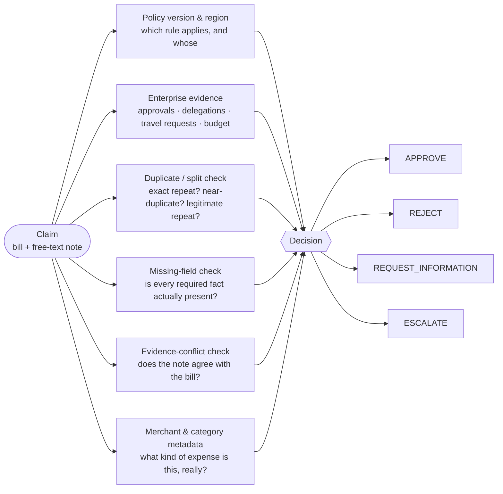
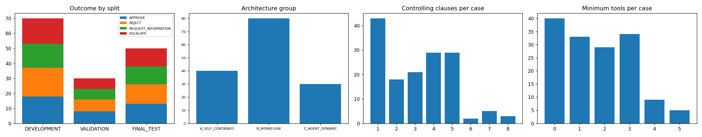
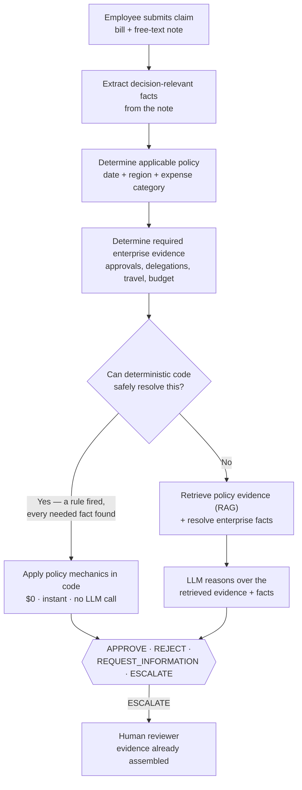
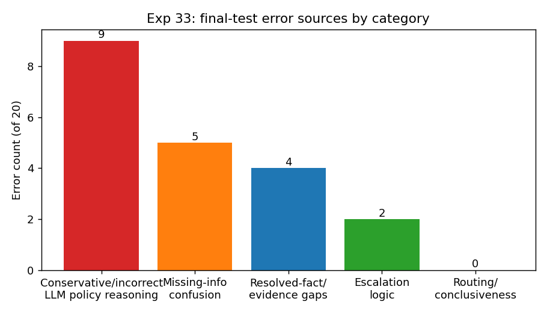
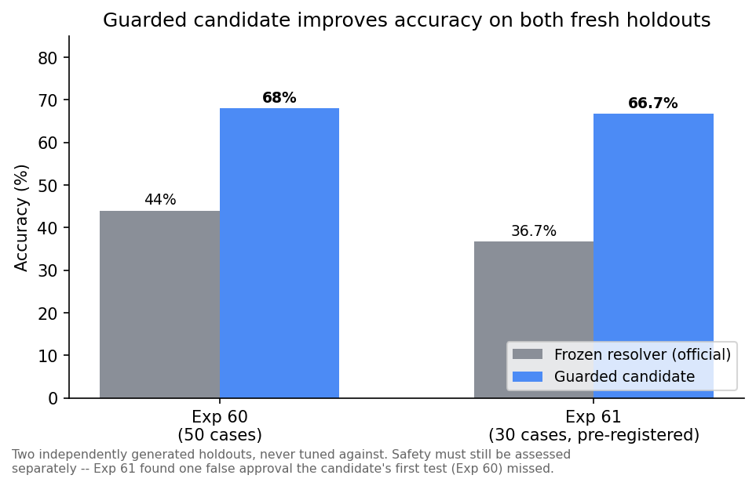
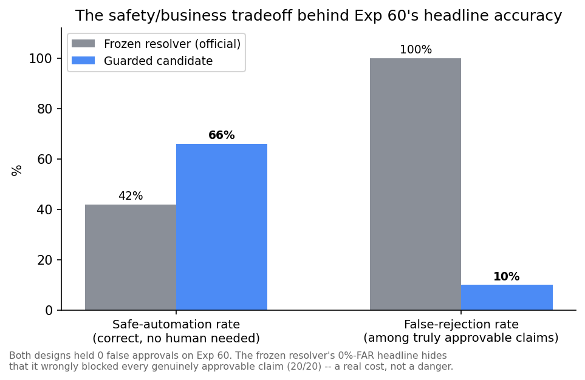

# ExpenseGuard

*A bounded expense-compliance decision system that combines deterministic rules, evidence-grounded LLM
reasoning, and explicit human escalation.*

[](https://www.python.org/)
[](https://react.dev/)
[](tests/)
[](docs/owasp_llm_top10_2026.md)

*PE6201 (Emerging AI Technologies) end-of-course project.*

## Problem

Finance reviewers must decide whether an employee expense is ready for reimbursement using a bill, a
free-text note, company policy, and enterprise records. Routine claims and genuinely ambiguous claims
currently compete for the same reviewer attention, even though only a subset actually requires human
judgment.

- A claim is just a **bill + a free-text note** — nothing pre-extracted, nothing structured.
- Decision-critical facts (nights stayed, attendee counts, exception references, even the expense
  category) are buried in prose, not form fields.
- Checking one claim means cross-referencing a **22-document policy corpus** and **11 enterprise systems**
  (approvals, delegations, travel requests, budgets, prior claims) by hand.
- A wrong **approval** costs real money; a wrong **rejection** or unnecessary escalation costs reviewer
  time and employee trust. Both are real failure modes, not just one.

## At a glance

| Dataset | Experiments | Official result | Candidate result | Development spend |
|---|---|---|---|---|
| 150 claims · 22 policies · 11 systems | 55 | 60%, 0/37 FAR | 68% / 66.7% on fresh holdouts | $7.38 / $8.00 |

## Table of contents
[Problem](#problem) · [At a glance](#at-a-glance) · [Product overview](#product-overview) · [Primary user](#primary-user-and-what-changes) ·
[Why AI, and why not everywhere](#why-ai-and-why-not-ai-everywhere) · [Closest alternatives](#closest-alternatives-and-the-gap) ·
[Build vs. buy](#build-vs-buy) · [Dataset & evaluation](#dataset-and-evaluation-design) · [Architecture](#architecture) ·
[Metrics](#metrics-target-and-baseline) · [Results](#results) · [Business impact](#business-impact-and-cost) ·
[Experiments](#experiments) · [Responsible AI & security](#responsible-ai-security-and-guardrails) ·
[Limitations](#limitations-and-evaluation-critique) · [Quick start](#quick-start) · [Reproducibility](#reproducibility) ·
[Repo map](#repository-map) · [Demo](#demo--ui) · [Documentation index](#deliverables-and-documentation-index)

---

## Product overview

**Input → Processing → Output:**

- **Input:** a bill (merchant, amount, currency, category) + a free-text employee note. Nothing else.
- **Processing:** deterministic rules where provable, retrieval-grounded LLM reasoning for the residual,
  never a guess under uncertainty.
- **Output:** one of **APPROVE / REJECT / REQUEST_INFORMATION / ESCALATE**, with the policy clauses and
  resolved facts behind the decision attached — no answer without evidence.

**What actually goes into one decision** — the claim is two fields; everything else is a check run against
it:



Each factor is a real, callable check (`src/tools.py`, `src/rules_v2.py`) — not a prompt instruction asking
the model to "consider" it. A decision is only as trustworthy as the checks actually run, which is why
`REQUEST_INFORMATION` exists: if a required factor can't be resolved, the system says so by name instead
of guessing.

**Intended use:** decision support and selective automation for a human finance reviewer. **Explicit
non-use:** no payment execution, no autonomous reimbursement, no fraud accusation or employee-risk
scoring, no irreversible action — every enterprise tool is read-only, and `ESCALATE`/
`REQUEST_INFORMATION` are safe, first-class outcomes, never forced guesses.

## Primary user and what changes

**Maya — finance operations analyst**, reviewing expense claims against company policy. It's 4pm on the
last day of the month, and her queue has 60 claims in it. She already knows the policy corpus cold and
roughly which categories tend to cause trouble (hotel ceilings, mileage math); what she doesn't have is
time to re-verify every routine claim against every record by hand, or visibility into which few of the 60
actually need her judgment.

| Before ExpenseGuard | After ExpenseGuard |
|---|---|
| Manually reads every claim, travel record, approval, exception, prior claim | Only sees claims with missing evidence, conflicting evidence, or policy-mandated human review |
| Spends equal time on routine and hard cases | Attention concentrated on the hard cases |
| Decisions and reasoning vary reviewer to reviewer | Routine claims resolved consistently, with cited evidence |

Employees benefit too: faster resolution, specific requests for missing information instead of silence,
and evidence-backed reasons for a rejection — not just "denied."

## Why AI, and why not AI everywhere

Each component owns only the part of the decision it's actually suited to:

| Component | Owns | Example |
|---|---|---|
| **Code** | Arithmetic, thresholds, dates, exact-duplicate matching | Hotel ceiling math, FX conversion, submission-window checks |
| **Retrieval (RAG)** | Grounding a decision in the actual policy text | Finding the clause that governs a specific claim |
| **LLM** | Semantic interpretation of free text | Reading an ambiguous note, reconciling it against retrieved policy |
| **Fixed workflow** | Predictable external-evidence paths | Hotel claim → policy → employee grade → travel approval → threshold |
| **Bounded agent** | Only when an earlier tool result determines what to check next | A genuinely dynamic evidence path, not a fixed checklist |

This split is a measured conclusion, not a design preference: Exp 9/11 showed retrieval quality barely
moved accuracy once the model had it, and Exp 19/20 showed an unconstrained agent added no measurable
value over a fixed workflow on first test — autonomy had to re-earn its place later, with a structural fix
(Exp 56), not a bigger prompt.

## Closest alternatives, and the gap

Enterprise platforms (SAP Concur / Concur Detect, Brex, Ramp) already automate large parts of expense
compliance. This project doesn't claim AI-based expense checking is new. The narrower question it
investigates: **does dynamic, cross-system evidence gathering add measurable value when the correct next
check depends on what a previous lookup reveals** — and if so, how much architectural complexity does that
actually justify, versus a deterministic-first design? [`problem.md` §3](problem.md).

## Build vs. buy

**Rent:** the foundation model (`openai/gpt-4o-mini` / `llama3.2:3b`) and the embedding model
(`voyageai/voyage-4-lite`) — commodity capability this project's own experiments (Exp 8, 35, 46) confirmed
was not the actual bottleneck. **Own:** policy mechanics, retrieval tuning, the enterprise-tool layer,
orchestration and guardrails, and the evaluation harness.

**Why code over a low-code/no-code rule builder:** for this research project, code was chosen over low-code
because reproducible experiments, typed interfaces, unit tests, versioned freeze manifests, and controlled
ablations were first-class requirements — not a claim that low-code tooling is fundamentally incapable of
this problem. Full layer-by-layer breakdown: [`docs/build_vs_buy.md`](docs/build_vs_buy.md).

## Dataset and evaluation design

| | |
|---|---|
| Claims | **150** — 70 development / 30 validation / 50 held-out final test |
| Policy corpus | **22 documents**, ~38 pages — global rules × 3 policy years, regional addenda, circulars |
| Enterprise tables | **11**, read-only — approvals, delegations, travel requests, budgets, prior claims |
| Ground truth | Isolated in `04_ground_truth_PRIVATE/`, joined only by the evaluator — never read at runtime |

A claim looks like this — nothing pre-extracted, the note is the only place most facts live:

```json
{
  "case_id": "X2-001",
  "bill": { "merchant": "PureYoga Club", "country": "Singapore", "total": 24.9, "merchant_category": "OTHER" },
  "employee_description": "so um this is for a charge for the renewal at PureYoga Club you know it's in Singapore and um it really keeps me sane during the busy quarter...",
  "project_id": "PRJ-003"
}
```


*150 claims, 3 architecture groups, outcome distribution by split — real counts from the generated dataset.*

Ground truth is physically isolated and leakage-tested (`tests/test_no_leakage.py`); the dataset is
synthetic by design (no real employee or company data) and was hardened across three rounds so
decision-critical facts live only in free text, never a structured field — case-family detail and
generation methodology: [`docs/dataset_card.md`](docs/dataset_card.md),
[`docs/synthetic_data_provenance.md`](docs/synthetic_data_provenance.md).

## Architecture



This is the **official, frozen architecture** (Exp 30/32). A second, later design — a bounded agent whose
tools *compute* the disposition in code, gated so the model can't override a correct tool answer — scores
higher on development/validation but has no authorized frozen final-test result (see [Results](#results)).

**The complexity ladder — one rung at a time, only when the previous one proved insufficient:**

| Rung | Added because | Kept or dropped |
|---|---|---|
| Deterministic rules | Arithmetic, dates, explicit ceilings are checkable — no reason to ask a model | **Kept** — 22/22 (100%) on unseen final-test claims |
| RAG | Facts live in free text; rules alone can't read prose | **Kept**, tuned (chunking, top-K, hybrid retrieval, metadata filter) |
| Fixed workflow | Tested whether a fully pre-declared pipeline beats ad-hoc LLM reasoning | **Rejected** — more accurate (64%) than LLM-only, but unsafe alone (13.5% FAR) → motivated the deterministic/LLM-residual selective resolver instead |
| Bounded agent | Tested whether dynamic tool choice earns its cost over a fixed workflow | **Rejected at first gate** (Exp 20, 3x the FAR) — reopened later only once tools computed answers in code |

**Key tradeoffs made, explicitly:**
- **Accuracy was traded for safety, repeatedly** — the official, frozen architecture is *not* the most
  accurate one tested; it's the one with 0% observed false approvals. A 64%-accurate fixed workflow was
  rejected for a 13.5% false-approval rate.
- **A frozen final-test result was treated as non-negotiable evidence**, not a formality — the
  higher-scoring guarded-agent candidate is still not promoted to that status because it has never earned one.
- **"0% FAR" was not trusted on a single sample** — a second, independent, pre-registered holdout (Exp 61)
  was run specifically to stress-test that claim, and it found a real gap the first holdout missed.

## Metrics: target and baseline

The metric family used for every architecture decision: **accuracy, observed False Approval Rate, Safe
Automation Rate, Human Review Rate, cost per 1,000 claims, and latency** — never accuracy alone
(`docs/cost_and_business_impact.md`). The majority-class baseline (always predicting the most common
ground-truth outcome) scores 26–27% — a floor, not a competitor.

**Target:** observed FAR = 0% is a hard constraint, never traded off; subject to that constraint, accuracy
is maximized. This is why Exp 18's fixed workflow (64.3% dev accuracy, the highest raw accuracy of any
architecture tested) was rejected in favor of Exp 30's selective resolver (61.4% dev accuracy, observed FAR
= 0%).

**The accuracy floor stated numerically** — accuracy ≥ 60%, the bar Exp 32 actually cleared — is a
**post-Exp-32 operational acceptance criterion**, fixed *after* seeing that result and applied to every
later candidate since (Exp 45–61). It is not claimed as a target pre-registered ahead of the original
freeze decision.

## Results

### Baseline — the official, frozen result

**Exp 32, one-shot, 50-claim held-out final test** — compared here to majority-class REJECT (26.0%
accuracy, 0% FAR, computed from real ground truth):

| Metric | Value | Takeaway |
|---|---|---|
| Accuracy | **30/50 = 60%** | More than double the majority-class baseline (26%) |
| Observed false approvals | **0/37 = 0%** | Zero bad approvals in this one-shot evaluation run |
| Deterministic path | **22/22 = 100%** | Every claim code could resolve, it resolved correctly |
| LLM-residual path | **8/28 = 28.6%** | The one weak component — motivated everything below |


*n=20 residual-path errors, final test. Takeaway: errors were policy-reasoning failures, not retrieval
failures — 0 of 20 were caused by missing evidence.*

### The improvement journey

The 28.6% LLM-residual accuracy above was the dominant measured weakness in the frozen architecture.
28 more experiments (Exp 34–61) built and stress-tested a second design — a guarded agent whose tools
compute the answer in code instead of leaving it to free-form LLM judgment — then evaluated it head-to-head
against the frozen baseline on two separate, independent fresh holdouts:

| Fresh holdout (never seen by either design) | Baseline (frozen resolver) | Candidate (fixed, guarded agent) | Change |
|---|---|---|---|
| Exp 60 — 50 cases | 22/50 = 44% | **34/50 = 68%** | **+24 percentage points** |
| Exp 61 — 30 cases, pre-registered | 11/30 = 36.7% | **20/30 = 66.7%** | **+30 percentage points** |



The improvement reproduced across two independently generated synthetic holdouts, making a single-sample
explanation less plausible — Exp 61's holdout is the methodologically stronger of the two: its evaluation
protocol was named and frozen in a committed manifest *before* any holdout case was generated. Both
holdouts' claim notes were drafted by the same model family used for inference (see
[Limitations](#limitations-and-evaluation-critique)), so transfer to human-authored production claims
remains untested. The candidate also held up on the splits it was built against: 44/70 dev (62.9%), 21/30
validation (70.0%).

**Why Exp 61 is pre-registered but the candidate still isn't "formally validated":** Exp 61 is a
pre-registered *stress-test* holdout, built to try to break the fix, not to serve as the project's
replacement final-test protocol. Promotion to official status would require a separately frozen evaluation
specifically designed for that decision, at Exp 32's scale — not a re-use of a stress test, however rigorous.

The baseline's weakness wasn't noise — it had never once produced a correct APPROVE, on any split, ever
(0/13 final test, 0/20 Exp 60, 0/15 Exp 61). The candidate recovers real APPROVE recall (12/20, 9/15),
each one backed by a tool result, not a model's free-form judgment.

### Why it isn't the official architecture yet

A higher number alone isn't the bar this project uses — observed FAR = 0% is. **Independent stress testing
of the candidate** found it held that bar on its first fresh test (Exp 60) but not on a second,
deliberately harder, pre-registered one (Exp 61):

| | Official frozen architecture | Guarded-agent candidate |
|---|---|---|
| Tested on | 50-claim final test (official, one-shot) | 70 dev + 30 validation (authorized), + 2 fresh holdouts above |
| False approvals, ever | 0 (82 non-approvable cases across 3 independent evaluations) | 1 (45 non-approvable cases across both fresh holdouts, ~2.2%) |
| Status | **Official, frozen architecture** | **Leading development candidate** — not promoted |

That one false approval (Exp 61, a gift-form parsing gap, [diagnosed and disclosed](docs/exp61_v3_holdout.md))
is the actual reason the candidate isn't official yet — not a lack of accuracy. A stronger model (gpt-4o)
pushed accuracy to 78% on Exp 60 but introduced 2 false approvals there — accuracy and safety move
independently, not together. Full detail: [`docs/exp60_fresh_holdout.md`](docs/exp60_fresh_holdout.md),
[`docs/exp61_v3_holdout.md`](docs/exp61_v3_holdout.md).

**In one sentence:** the guarded architecture appears to solve substantially more of the original business
problem than the frozen baseline, but it has not yet met this project's safety threshold consistently
enough across independent tests to be promoted.

### Safe-automation breakdown

Accuracy alone blends a false approval (a safety failure) with a false rejection (a real claim wrongly
blocked — a cost, not a danger). Broken apart, Exp 60 (n=50, of which 20 cases are truly approvable):

| | Safely automated, correct (of all 50) | False approvals (of 30 non-approvable) | False rejections (of all 50) | **False-rejection rate (of 20 truly approvable)** |
|---|---|---|---|---|
| Frozen resolver (baseline) | 21/50 = 42% | 0/30 | 20/50 = 40% | **20/20 = 100%** |
| Candidate, gpt-4o-mini | **33/50 = 66%** | 0/30 | 2/50 = 4% | **2/20 = 10%** |



*Takeaway: the baseline's 0% FAR headline hides that, among claims that were genuinely approvable, it
wrongly blocked every single one (20/20) — a materially more informative statement than "40% of all
cases." The candidate cuts the same rate to 1 in 10 while holding false approvals at zero, on this test.*

## Business impact and cost

Per `problem.md` §36: **measured** system quantities and **assumed/modeled** business inputs are never
blended into one number.

**Baseline, how a reviewer does this today (industry figures, assumed, [GBTA Foundation](https://gbta.org/new-study-reveals-pain-points-in-expense-reporting/)):**
~20 minutes and ~$11.67 reviewer time per claim; ~19% of reports contain errors or missing information.

**Three cost layers, priced separately rather than blended:** direct AI inference cost → human-fallback
cost (escalation rate × assumed review cost) → error cost (false approval / false rejection, priced per
incident). Token cost alone is not the business decision — false approvals, false rejections, and
unnecessary escalation dominate the economics once priced, which is why a corrected cost model changed
which architecture looked cheaper (full model: [`docs/cost_and_business_impact.md`](docs/cost_and_business_impact.md)).

| Metric | Value | Measured or assumed |
|---|---|---|
| Cost per claim (frozen design) | **~$0.0005/claim** | **Measured** |
| Human Review Rate, official final test | **22.0%** — 78% of the 50 final-test claims required no human review | **Measured** |
| LLM-residual latency, official final test | **Median 1.3s, P95 2.6s** (model inference only) | **Measured** |
| Observed false-approval rate | **0/37 = 0%**, final test | **Measured** (not a guarantee — see Limitations) |
| False-rejection rate among truly approvable claims | **100% observed** (Exp 60, frozen baseline) — candidate cuts this to 10% | **Measured** |
| This project's own development spend | **$7.38 of an $8.00 tracked budget** | **Measured** |

Operating economics at scale are dominated by human fallback and decision-error costs, not token spend —
once those are priced, they decide which architecture is actually cheaper, not raw inference cost. Full
scenario modeling (low/base/high volume, full cost-per-1,000-claims range):
[`docs/cost_and_business_impact.md`](docs/cost_and_business_impact.md).

**The argument this supports:** *if* a real deployment's manual-review time resembles the ~20-minute
industry baseline, resolving 78% of final-test claims without a human, at sub-3-second residual-path
latency, reduces avoidable review effort. No claim of measured production savings is made — that requires
a real deployment, not this synthetic benchmark.

## Experiments

**55 experiments, numbered 0–61, 7 phases** — numbers 21–27 were deliberately skipped (the agent-value
gate closed before those were needed; see [Limitations](#limitations-and-evaluation-critique)). Every
number traces to a file under `results/current/`; full write-ups: [`docs/README.md`](docs/README.md#full-experiment-index).
Every experiment with its description, why it was run, what was inferred, and why it led to the next one:
[`docs/experiment_table.md`](docs/experiment_table.md).

| Phase | Experiments | Outcome |
|---|---|---|
| 1. Baselines & retrieval | 0–17 | Retrieval was not the dominant bottleneck — a perfect policy oracle produced only a modest accuracy gain |
| 2. Workflow vs. agent gate | 18–20 | Workflow more accurate (64%) but unsafe (13.5% FAR) → motivated the selective design |
| 3. Freeze & final test | 28–33 | **Official result: 30/50 (60%), observed FAR 0%** |
| 4. Agentic-RAG diagnosis | 34–39 | Stricter prompts, bigger models, parallel calls all failed; the agent's own retrieval queries recalled only 33.6% of required clauses |
| 5. Guarded-agent build | 40–52 | 44/70 dev, 21/30 validation, 0% FAR — promising, not yet held-out tested |
| 6. Root-cause, fix, fresh holdout | 53–60 | Diagnosed 3 root causes live, fixed each: 0% FAR, 68% accuracy on a fresh, never-seen holdout |
| 7. Pre-registered second holdout | 61 | Found "0% FAR" did not survive — a real false approval, disclosed, not fixed |

## Responsible AI, security, and guardrails

Full risk table: [`docs/responsible_ai_risk_table.md`](docs/responsible_ai_risk_table.md). Security tested
against the OWASP Top 10 for LLM Applications (2026 edition, published 2026-08-04):

- **Zero fabricated policy citations** — all 897 citations ever saved, checked against the real corpus.
- **Budget and step caps verified live** — `MAX_BUDGET_USD` confirmed to actually raise `BudgetExceeded`.
- **Prompt injection (LLM01) is not solved** — a retrieval-text injection attack defeated the current
  defense once, live, in testing. Disclosed, not patched and silently claimed fixed.
- **Hidden Context Exposure (LLM08) is only partially tested** under its newly broadened 2026 scope.
- The remaining categories are documented in the full assessment, with executed evidence or explicit scoping.

Full 10-category assessment: [`docs/owasp_llm_top10_2026.md`](docs/owasp_llm_top10_2026.md).

## Limitations and evaluation critique

- **The guarded-agent candidate has no authorized, frozen final-test result.** Two independent fresh
  holdouts exist (Exp 60, Exp 61) — real evidence the fixes generalize, not a substitute for a formal,
  Exp-32-scale final test.
- **Observed FAR = 0% is not an established property of the candidate** — combined observed FAR is ~2.2%
  (1/45), found by deliberately testing the claim a second time rather than trusting one result. Small
  sample sizes (30–50 cases per holdout) mean these rates carry real statistical uncertainty.
- **Synthetic benchmark, not production evidence** — every claim, policy document, and enterprise record
  is generated.
- **Same-model blind spot** — every claim note, in every split including both fresh holdouts, was drafted
  by the same model (`gpt-4o-mini`) that the system also uses to decide them; this benchmark cannot rule
  out that some measured accuracy reflects the model parsing its own writing style rather than reasoning
  that would transfer to real claims.
- **Prompt injection is not solved** — a retrieval-text injection attack defeats the current defense
  outright (Exp 28).
- **The held-out final-test data was touched more than once after the Exp 32 freeze**, by processes not
  fully reconstructable from committed logging — did not change the official result, but "touched once" is
  no longer an unqualified statement about this project. Full disclosure:
  [`docs/second_touch_disclosure.md`](docs/second_touch_disclosure.md).
- **Experiments 21–27 were deliberately skipped**, not forgotten or lost — Exp 20 failed the pre-defined
  agent-value/safety gate, so the agent-optimization experiments planned as 21–27 were never run.
- **No real-world validation or deployment plan exists** — this is decision support for a research
  benchmark, not a production system.

## Quick start

Everything free (tests, dataset validation, the static UI export, `llama3.2:3b` experiments) runs with no
account and $0. Anything marked "paid" needs your own OpenRouter API key and spends real money.

```bash
git clone <this-repo-url> && cd ExpenseGuard-Resolves-Expense-Claims-with-Evidence
pip install -r requirements.txt            # numpy, matplotlib, pandas, jupyter — runtime code itself is stdlib-only
python -m unittest discover -s tests       # $0, 44 tests — confirms the checkout is sound
```

**Then, optionally, the paid route** — copy `.env.example` to `.env` first:

| `.env` variable | For | Notes |
|---|---|---|
| `OPENROUTER_API_KEY` | Paid-model calls | openrouter.ai — costs real money once set |
| `PAID_MODEL` | Paid experiments | Defaults to `openai/gpt-4o-mini` |
| `LOCAL_MODEL` | **Free** experiments | `llama3.2:3b` via [Ollama](https://ollama.ai) |
| `MAX_BUDGET_USD` | Any paid call | This project's own tracked cap — separate from, and smaller than, your OpenRouter account's own usage cap |

The dataset was regenerated once after Exp 32's official run, so that result
(`results/current/final_test/exp32_final_test/`) can no longer be byte-verified against the files on disk
today; it stands as the honest record of that one run (detail:
[`docs/synthetic_data_provenance.md`](docs/synthetic_data_provenance.md)).

**Then, the live demo:**
```bash
python -m ui.backend.server                              # backend, http://localhost:8787
cd ui/frontend && npm install && npm run dev              # frontend, http://localhost:5173
```
Four verified walkthrough cases: [`docs/demo_script.md`](docs/demo_script.md).

## Reproducibility

```bash
python -m unittest discover -s tests      # leakage, tool, workflow checks — 44 tests, $0
python -m dataset_generator.validate      # dataset integrity audit — 50/50 checks, $0
```

- Every result traces to a file under `results/current/` — nothing in these docs is hand-typed.
- `tests/test_no_leakage.py` enforces that runtime code never reads `04_ground_truth_PRIVATE/`.
- **`python -m scripts.exp32_final_test` is the frozen final test — already run once. Do not rerun it** —
  see [`docs/second_touch_disclosure.md`](docs/second_touch_disclosure.md) for what happens when this rule
  is violated.
- Regenerate the dataset from scratch (deterministic, seed 6202, not required to run anything above):
  `python -m dataset_generator.build`.
- **Data explainer:** [`docs/dataset_card.md`](docs/dataset_card.md), [`docs/synthetic_data_provenance.md`](docs/synthetic_data_provenance.md).
- **Evals explainer:** [`docs/EVALS.md`](docs/EVALS.md) — every metric, split, freeze manifest, the evaluator, and which results must never be rerun, in one page.
  Also: [`docs/reproducibility_and_repo_map.md`](docs/reproducibility_and_repo_map.md).

## Repository map

| Path | Contents |
|---|---|
| `ExpenseGuard_DATASET/` | Claims, policy corpus, enterprise tables, isolated ground truth |
| `src/` | Runtime code — deterministic rules, typed tools, resolver, bounded agent, retrieval, evaluator |
| `dataset_generator/` | Dataset generator — case archetypes, policy text, semantic-hardening layer |
| `scripts/` · `notebooks/` | One script and one notebook per experiment |
| `tests/` | Unit tests, including the leakage guard |
| `experiments/` | Pre-registered freeze manifests (Exp 32, Exp 61) + the Exp 60/61 holdout datasets |
| `results/current/` | Predictions, metrics, plots, cached embeddings — single source of truth |
| `docs/` | One write-up per experiment (hypothesis → method → result → decision) |
| `ui/` | Local demo app — browse the dataset or run either design live |

Six files worth reading first, runtime behavior in order of what decides a claim:
`src/resolver.py` (the official pipeline) → `src/workflow_v2.py` (the fixed-workflow design) →
`src/agent.py` (the bounded agent loop) → `src/tools.py` (typed enterprise tools) →
`src/evaluate.py` / `src/metrics.py` (scoring — never imported by runtime code).

## Demo / UI

**Recorded demo:** [Watch the 5-minute project walkthrough](#) *(link pending — add once recorded)*.

```bash
python -m ui.backend.server && cd ui/frontend && npm install && npm run dev   # see Quick start above
```

Five tabs: **Overview** (problem, persona, before/after cases, cost and safety breakdowns, presenter
quick-jump bar), **Review Dashboard** (Maya's daily queue — every claim triaged by the shipped
architecture's decision, flagged by what actually needs her), **Case Explorer** (every claim, both
architectures' decisions side by side, full tool trace, ground truth), **Build & Architecture** (pipeline
diagrams, cost model, OWASP results, build-vs-buy table), **Project Story** (the full 21-section deep dive,
its own in-page nav). A design-rationale gallery of every retrieval/chunking/model experiment's own plot
lives in `results/current/plots/`.

*A Case Explorer screenshot (claim → decision → policy evidence → tool trace) belongs here too — not
captured yet; this environment has no headless-browser tooling installed to generate one automatically.
Easiest path: run the demo above and screenshot the Case Explorer tab with a case selected.*

## Deliverables and documentation index

- **Dataset** — 150 synthetic claims, 22-document policy corpus, 11 enterprise tables, isolated ground
  truth, deterministic generator (`dataset_generator/`).
- **Four architectures, implemented and compared** — deterministic rules, RAG, fixed workflow, bounded
  agent — plus the selective hybrid that's the official, frozen architecture.
- **Evaluation harness** — leakage-safe evaluator, freeze-manifest discipline, cost model, OWASP Top 10
  security assessment.
- **55 experiment write-ups** (`docs/`), each hypothesis → method → result → decision, traced to saved
  result files.
- **Local demo application** — React frontend + Python backend, browse all 150 cases or run either design
  live against a free or paid model.
- **Final report** — [`docs/FINAL_REPORT.md`](docs/FINAL_REPORT.md), ~1,200 words.

**Documentation index:**
- Full diagnostic story, every experiment, extended flowcharts: [`docs/README.md`](docs/README.md)
- Business problem and scope: [`problem.md`](problem.md)
- Cost and operating-cost model: [`docs/cost_and_business_impact.md`](docs/cost_and_business_impact.md)
- Responsible AI / full OWASP Top 10 for LLM Applications (2026) results: [`docs/responsible_ai_risk_table.md`](docs/responsible_ai_risk_table.md), [`docs/owasp_llm_top10_2026.md`](docs/owasp_llm_top10_2026.md)
- Bugs found after the freeze, documented not silently patched: [`docs/post_freeze_findings.md`](docs/post_freeze_findings.md)
- Disclosure: the held-out data touched after the freeze: [`docs/second_touch_disclosure.md`](docs/second_touch_disclosure.md)
- Root-causing the candidate's missed APPROVE cases (Exp 53–59): [`docs/exp53_approve_calibration.md`](docs/exp53_approve_calibration.md) → [`docs/exp59_final_fix.md`](docs/exp59_final_fix.md)
- Fresh-holdout validation and the stronger-model safety tradeoff (Exp 60): [`docs/exp60_fresh_holdout.md`](docs/exp60_fresh_holdout.md)
- Pre-registered second holdout that found the candidate's first false approval (Exp 61): [`docs/exp61_v3_holdout.md`](docs/exp61_v3_holdout.md)
