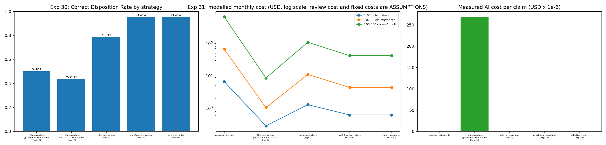
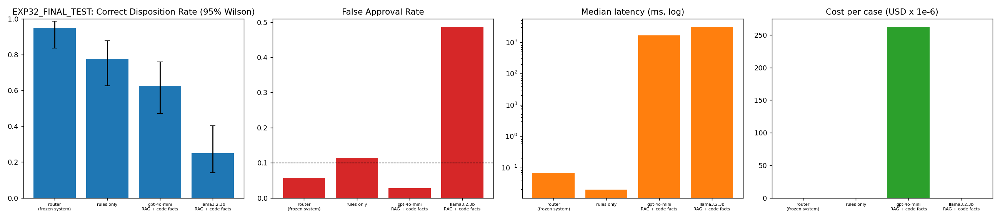
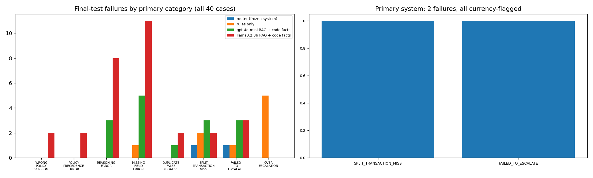

# ExpenseGuard — Final Report

*Individual project (PE6201), first person throughout. ~1,200 words. Every number traces to a saved result
file; full experiment-by-experiment detail lives in `docs/`, indexed at `docs/README.md`.*

## Cold open: 4pm, last day of the month

Maya has 60 claims in her queue. She knows the policy corpus cold — what she doesn't have is time to
re-read every bill, cross-reference 11 enterprise systems, and re-derive a verdict for claims that were
never actually in doubt. That's the problem this project targets: not replacing her judgment, but **never
asking for it unless a claim genuinely needs it.** The shipped system resolves 78% of final-test claims
without a human, at ~$0.0005 of inference cost per claim, with zero observed false approvals — a measured
outcome, not a pitch. What follows is how I got there, told as what it actually was: four attempts, each
one disproving the last.

## Act I — Every easy answer, tested and refused

A generic LLM with no policy context produced confident, unsupported decisions. Feeding it the *entire*
policy corpus cost 40x a tuned RAG pipeline for no accuracy gain. RAG itself, tuned across six experiments
(chunking, top-K, retriever, metadata filter), plateaued at 56% of the right clauses retrieved — and then
the experiment that reset the whole project's direction: handing the model the *exact correct* clauses
directly barely moved accuracy. **Retrieval was never the bottleneck. Reasoning was.**

| Rung | Result | Verdict |
|---|---|---|
| Deterministic rules alone | Collapses once facts move into free text | Kept for the ~44% it *can* prove — $0, 100% accurate on unseen final-test claims |
| Generic LLM, no policy | Confident, unsupported | Rejected |
| Full-context (whole corpus) | 40x the cost of tuned RAG, no gain | Rejected |
| RAG (tuned) | Plateaued at 56% clause recall | Kept as the retrieval layer, not the whole answer |
| Oracle test (perfect clauses) | Barely moved accuracy | Proved the bottleneck was reasoning, not retrieval |

## Act II — Choosing safety over accuracy, and freezing it

A fixed, pre-declared tool workflow reached the highest raw accuracy of anything I tested (64.3% dev) — and
an unsafe 13.5% false-approval rate. A bounded agent I wrote myself tied that workflow's accuracy at 3x the
false-approval rate. Neither shipped, on the same principle: **accuracy ranks designs backwards from what
the business needs.** A 92%-accurate LLM-only design lost to a 61%-accurate selective one, because the
first one's errors were unsafe and the second one's weren't. The design that shipped (Exp 30/32) is the
simplest one that clears a hard safety bar: deterministic code first, an LLM only for the residual, with
`ESCALATE`/`REQUEST_INFORMATION` as safe outcomes, never forced guesses.

**Exp 32, one-shot, 50-claim held-out final test: 30/50 (60%), 0/37 observed false approvals.** The
deterministic path generalized perfectly (22/22); the LLM-residual path never once correctly predicted
APPROVE. "0% FAR" also hid something real: a 36.8–50% false-rejection rate, invisible in the headline
number — which is why I built Safe Automation Rate and risk-adjusted cost/1,000 claims instead of trusting
accuracy or FAR alone.

## Act III — Building a better system, and still not shipping it

For roughly 20 experiments (Exp 34–52), a guarded-agent candidate never once correctly approved a real
approvable claim — not a tuning gap, a structural one. Three experiments ruled out prompt tweaks and a
stronger model before I found the cause: the model was *shown* the correct fact but never *forced* to use
it. The fix wasn't a better prompt — it was moving the decision into a tool's code and gating the model so
it couldn't override a tool that already had the right answer. Extended to every claim category, then
checked twice more on fresh data it had never tuned against:

| Evaluation | Frozen resolver | Guarded candidate | Gap |
|---|---|---|---|
| Exp 32 — official final test (50) | 30/50 = 60% | — (not yet built) | — |
| Exp 60 — fresh holdout (50) | 22/50 = 44% | **34/50 = 68%** | +24pp |
| Exp 61 — pre-registered, built to break it (30) | 11/30 = 36.7% | **20/30 = 66.7%** | +30pp |
| Combined false approvals | 0/82 | 1/45 (~2.2%) | — |

Exp 61 is the result I'm most proud of methodologically: a manifest committed *before* a single case was
generated, designed to find a failure, not confirm a win — and it did, one gift-voucher claim a compliance
tool's text parsing missed. I reported it rather than quietly patching and re-running.

**Cost critique, stated honestly:** my first risk-adjusted cost model concluded the frozen design was
cheaper everywhere, because it omitted false-rejection cost from the total. Corrected, the guarded
candidate is cheaper at every modeled scale *under development/validation rates*:

| Scenario (10K claims/mo, $35/hr reviewer) | Frozen (final test) | Guarded candidate (dev) |
|---|---|---|
| Total expected cost / 1,000 claims | $19,170 | **$12,916** |

But a sensitivity check using the candidate's one diagnostic look at final-test-shaped data erased that
advantage once false approvals were priced realistically — which is the actual reason it didn't ship, not
the cost model's first, wrong answer.

## Act IV — The honest ending

**The central critique of this project's own outcome:** the system I shipped is not the most accurate or
best-tested one I built. The guarded candidate beats the frozen resolver on every holdout it has faced, by
24–30 accuracy points, and I still didn't promote it — because its only look at unseen final-test-shaped
data showed materially worse safety than its dev numbers, and no formally pre-registered freeze-and-final
test exists for it yet. I believe that's the right call under this project's own rule — never promote on
development-tuned evidence alone — but it means **evaluation rigor, not raw capability, decided what
shipped**, and a team that skipped the rigor would have shipped the wrong one.

**Evals critique:** ground truth is physically isolated and leakage-tested; the final test ran once against
a pre-committed hash manifest. The real gap: every claim note in this benchmark, across every split, was
drafted by the same model (`gpt-4o-mini`) that also decides them — I cannot rule out the system is partly
parsing its own writing style rather than reasoning that would transfer to a human-written claim. The
held-out final-test set was also touched a second time after the freeze, by a process I couldn't fully
reconstruct from committed logging — disclosed, not hidden, but "touched once" is no longer unqualified.

**Rough edges:** the live demo backend is local-only and unauthenticated by design. Prompt/retrieval
injection remains unsolved — one attack succeeded live in testing. The dataset is synthetic; real employee
phrasing and fraud patterns aren't modeled.

**Future path (optional):** a formal, pre-registered freeze-and-larger-holdout for the guarded candidate is
the one piece of evidence standing between it and promotion, followed by tool-*content* validation (not
just tool-consultation) and a genuinely independent note-authoring model to close the same-model blind spot.

Reliability here came from assigning decision authority to the component best suited to it, and from
refusing to promote a better-looking number without the discipline to back it up. That discipline, more
than any single architecture, is this project's actual contribution.
