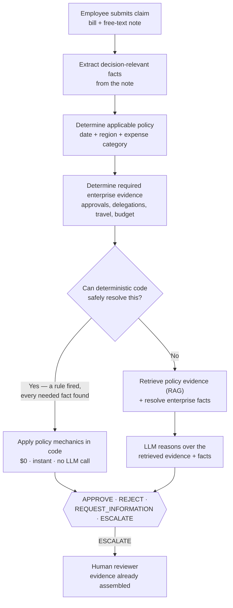

# ExpenseGuard — Product Documentation

One-page product summary: who it's for, what goes in and out, how it's built, and whether it hit its
target. For the full build log see [`docs/README.md`](README.md); for narrative detail see the
[top-level README](../README.md).

## Persona

**Maya — finance operations analyst.** End of month, 60 expense claims in her queue. She knows the policy
corpus cold but doesn't have time to re-verify every routine claim against every enterprise record by hand,
and has no way to tell upfront which of the 60 actually need her judgment.

| Before | After |
|---|---|
| Reads every claim, travel record, approval, exception, prior claim herself | Only sees claims with missing evidence, conflicting evidence, or policy-mandated review |
| Equal time on routine and hard cases | Attention concentrated on the hard cases |
| Decision and reasoning vary reviewer to reviewer | Routine claims resolved consistently, with cited evidence |

**Intended use:** decision support and selective automation for a human reviewer. **Explicit non-use:** no
payment execution, no autonomous reimbursement, no fraud/employee-risk scoring — every enterprise tool is
read-only.

## Input

A claim is two fields, nothing pre-extracted:

```json
{
  "case_id": "X2-001",
  "bill": { "merchant": "PureYoga Club", "country": "Singapore", "total": 24.9, "merchant_category": "OTHER" },
  "employee_description": "so um this is for a charge for the renewal at PureYoga Club...",
  "project_id": "PRJ-003"
}
```

- **Bill:** merchant, amount, currency, category.
- **Free-text note:** the only place most decision-critical facts live (nights stayed, attendee counts,
  exception references, even the real expense category).
- Everything else — applicable policy, approvals, delegations, travel requests, budget, prior claims — is
  looked up, not supplied.

## Output

One of **APPROVE / REJECT / REQUEST_INFORMATION / ESCALATE**, plus the policy clauses and resolved facts
behind the decision — no answer without cited evidence. `REQUEST_INFORMATION` and `ESCALATE` are safe,
first-class outcomes used whenever a required fact can't be resolved, never a forced guess.

## Architecture (high level)



Each box is a real, callable check (`src/tools.py`, `src/rules_v2.py`) — never a prompt instruction asking
the model to "consider" something. Code owns arithmetic/thresholds/dates; retrieval grounds the decision in
actual policy text; the LLM only handles semantic interpretation of free text once grounded evidence is in
hand. Full diagrams and the agentic-candidate variant: [`docs/README.md`](README.md#two-architecture-diagrams-clean-item-53).

## Metrics: targeted vs. reached

**Target (fixed before the frozen result, non-negotiable):** observed False Approval Rate (FAR) = **0%**;
subject to that constraint, maximize accuracy. Operational floor adopted after Exp 32: accuracy ≥ **60%**.

| Metric | Target | Reached (frozen, Exp 32, 50-claim held-out) |
|---|---|---|
| Accuracy | ≥ 60% | **30/50 = 60%** (vs. 26% majority-class baseline) |
| Observed FAR | 0% (hard constraint) | **0/37 = 0%** |
| Deterministic-path accuracy | — | **22/22 = 100%** |
| LLM-residual-path accuracy | — | **8/28 = 28.6%** (dominant weakness, drove 28 further experiments) |

Later candidate design (guarded agent, tools compute the disposition in code), evaluated on two independent
fresh holdouts never seen by either design — reported as a candidate result, not a replacement for the
frozen baseline above, since it has no authorized frozen final-test run of its own:

| Fresh holdout | Frozen baseline | Guarded-agent candidate | Change |
|---|---|---|---|
| Exp 60 (50 cases) | 22/50 = 44% | 34/50 = 68% | +24 pts |
| Exp 61 (30 cases, pre-registered) | 11/30 = 36.7% | 20/30 = 66.7% | +30 pts |

Full metric family (accuracy, FAR, Safe Automation Rate, Human Review Rate, cost/1,000 claims, latency) and
cost breakdown: [`docs/cost_and_business_impact.md`](cost_and_business_impact.md). Result provenance and
why accuracy was traded for safety: [top-level README, Results](../README.md#results).
